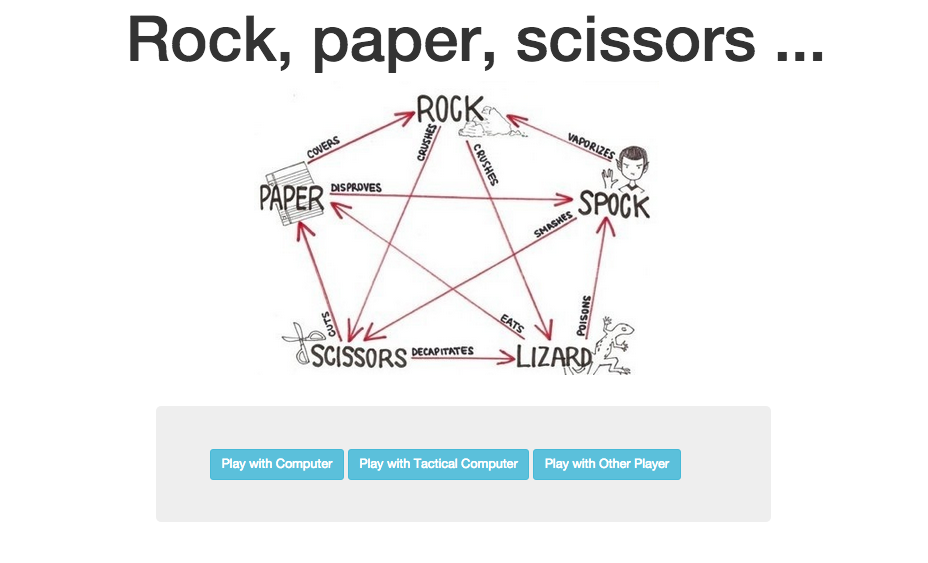
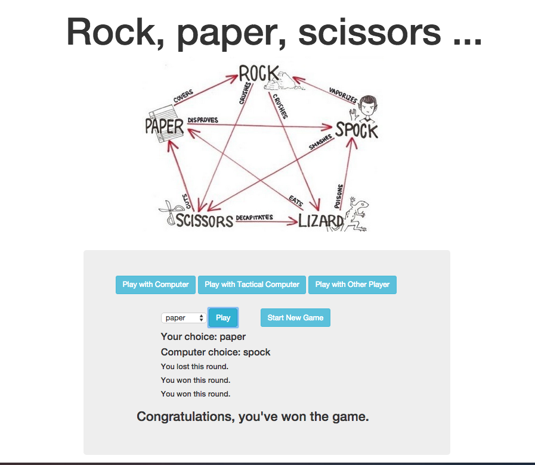
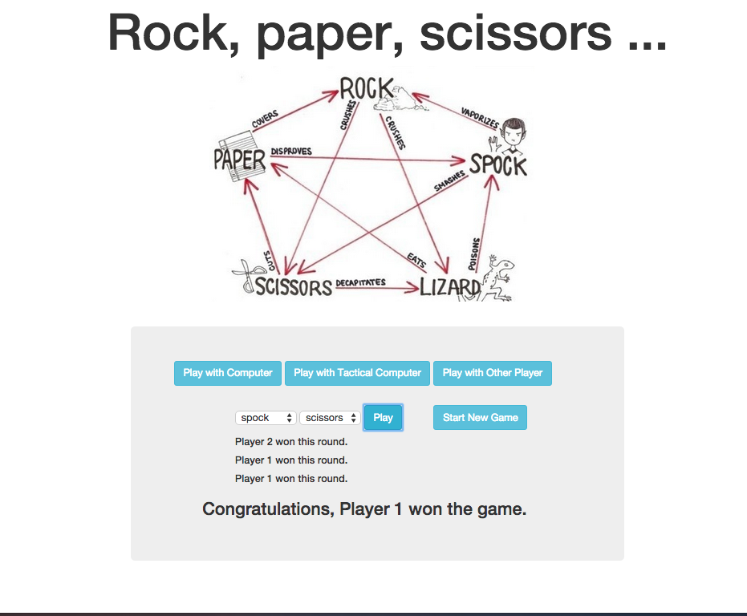

## Extended Rock Paper Scissors Game - Javascript

Rock Paper Scissors (plus spock and lizard) game in Javascript (AngularJS framework).

    

##Implemented features:

```
Player can choose rock, paper, scissors, lizard or spock.
Player can choose to play with random computer, tactical computer or other player.
Random computer player choose randomly between rock, paper, scissors, lizard or spock.
Tactical computer makes first choice randomly but in 2nd and 3rd round selects shapes which would beat his previous choice.
Game consist of 3 rounds.
Player can see his choice when playing with computer.
Player can see computer choice.
Player can see round result.
Player can see final game result.
Player can start new game.
```

##Approach:


##To run the app:


##To run the tests:


